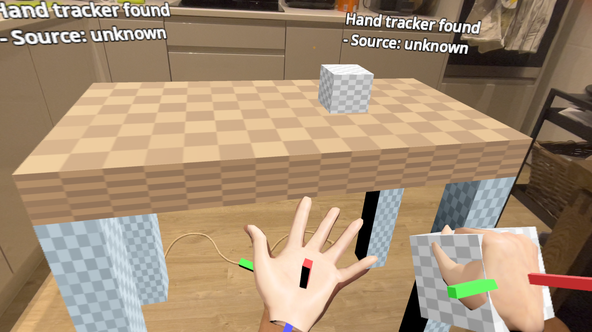
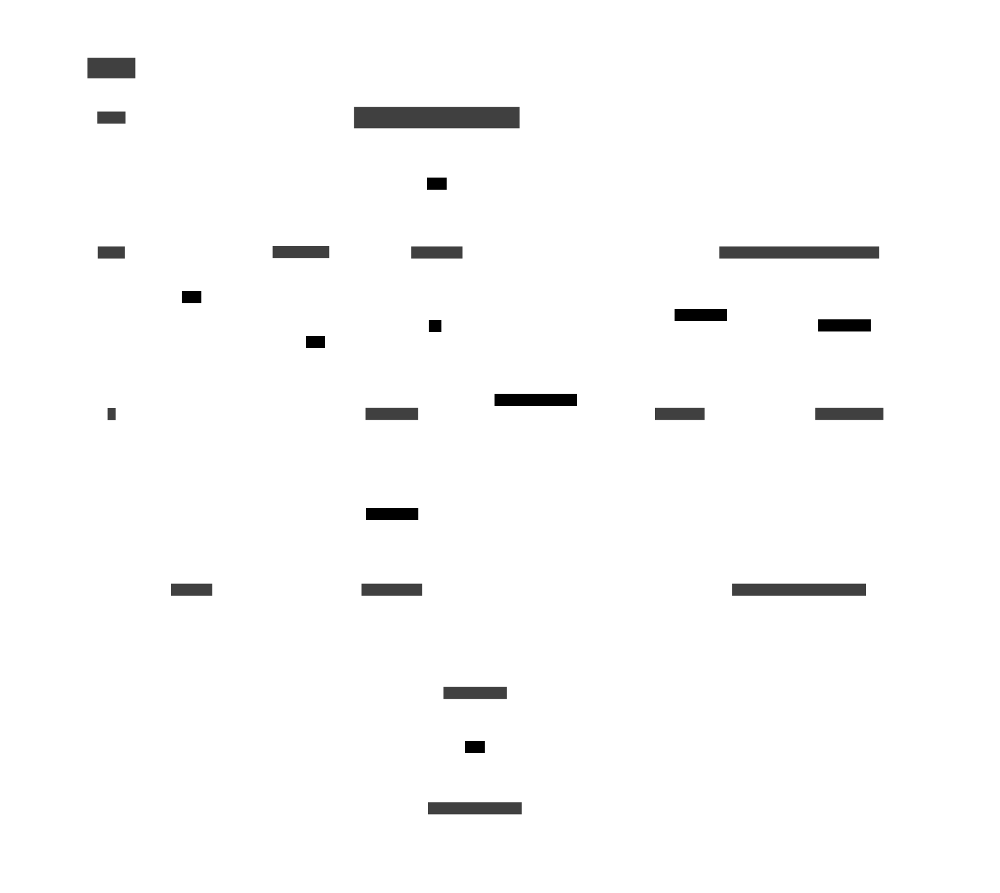

# Godot Vision OS

## What

In progress work to get godot running natively on VisionOS



## How

There's quite a few steps currently but its very similar to an iOS build.



### step 1
You need a build of [OpenVision](https://github.com/jamuus/OpenVision) which is an OpenXR implemention for VisionOS, you should be able to load that into xcode and build a .framework for sim and real device. Then throw down one of these

```
xcodebuild -create-xcframework \
  -framework "Debug-xros/OpenXRRuntime.framework" \
  -framework "Debug-xrsimulator/OpenXRRuntime.framework" \
  -output OpenXRRuntime.xcframework
```

and you got an OpenXR runtime that godot can call into.

### a

Build libgodot.a

script `build.sh` has the steps to build libgodot.a with visionos or visionos\_simulator target

### b

I don't _think_ you need an editor built from this repo at the moment but its probably a good idea. In the editor export your project for [iOS](https://docs.godotengine.org/en/stable/tutorials/export/exporting_for_ios.html) to generate an .xcodeproj, then open in xcode and change a bunch of settings:

* add Apple Vision as a Supported Destination
* add OpenXRRtuntime.xcframework as a lib
* copy libgodot.a to the right place(set env var dest to the godot .xcframework dir and run build.sh and it'll copy into the right place)
* set env var `XR_RUNTIME_JSON` to `@executable_path/../Resources/openxr_runtime.json` in the Edit Scheme menu

(This list probably isn't exhaustive yet cause I can't remember everything I did (proper VisionOS export template is TODO))

Some godot project settings that are recommended or required

* OpenXR Submit Depth Buffer on
* Hand Tracking and Hand Interaction Profile on

### æ

Build and run the game in xcode, it should work both in simulation and on device. Standard OpenXR hand tracking with all the joints works and the grip action has initial support. OpenVision recommends a high resolution render target which is then copied into the final output buffer using the fixed foveation avilable for metal renderers.


Thanks to Clancey who got godot building and [running in sim](https://github.com/godotengine/godot/pull/102110) for VisionOS, this is built on top of that

